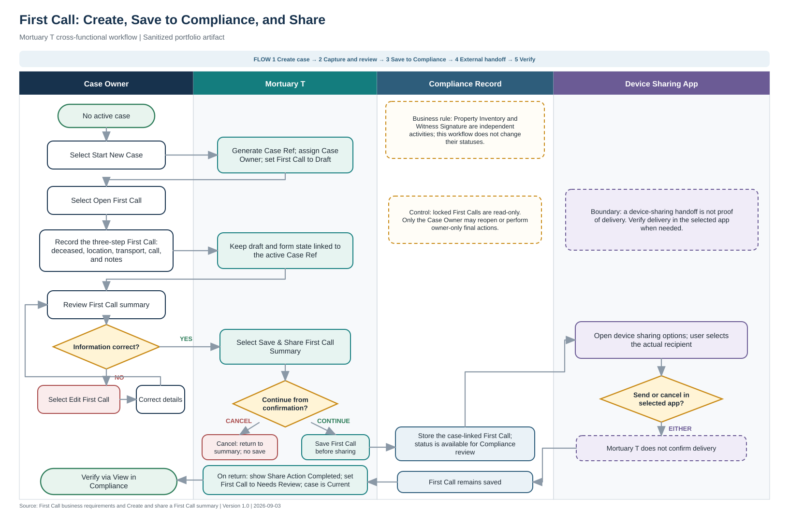

# First Call cross-functional workflow

## Document purpose

This swimlane shows how the Case Owner, Mortuary T, the Compliance record, and
the device sharing app participate in the documented First Call workflow. It
connects the user procedure to the First Call requirements and makes the
system boundary, decision points, handoffs, and exception paths visible.

This is a sanitized portfolio artifact. It contains no production records,
credentials, proprietary implementation details, or real decedent
information.

[Download the editable Visio drawing](../assets/business-analysis/mortuary-t-first-call-swimlane.vdx){ .md-button }
[Download the PDF](../assets/business-analysis/mortuary-t-first-call-swimlane.pdf){ .md-button }

!!! info "Visio format"
    The editable drawing uses Visio XML Drawing format (`.vdx`). Open it in
    Microsoft Visio, then use **Save As** to create a current `.vsdx` copy if
    needed.

## How to read the diagram

| Lane | Responsibility in this workflow |
| --- | --- |
| Case Owner | Starts the case, records and reviews First Call information, corrects information, and verifies the saved record. |
| Mortuary T | Creates the case state, keeps draft information linked to the Case Ref, saves the First Call, opens external sharing options, and displays the resulting statuses. |
| Compliance Record | Preserves the case-linked First Call for review, including when external sharing is canceled after the save. |
| Device Sharing App | Controls actual recipient selection and the external send-or-cancel action. |

## Decision and exception paths

| Decision | Result |
| --- | --- |
| **Information correct?** | **No** returns the Case Owner to **Edit First Call** and then to summary review. **Yes** proceeds to **Save & Share First Call Summary**. |
| **Continue from confirmation?** | **Cancel** returns to the reviewed summary without completing the save-and-share action. **Continue** saves First Call to Compliance before external sharing options open. |
| **Send or cancel in selected app?** | Either choice returns control from the device sharing app. Canceling at this point does not reverse the completed Compliance save. |

## Text alternative

The workflow begins when the Case Owner has no active case and selects **Start
New Case**. Mortuary T generates a Case Ref, assigns the Case Owner role, and
sets First Call to **Draft**. The Case Owner opens First Call and records the
available deceased, location, transport, call, and note information. Mortuary T
keeps that draft state associated with the active Case Ref.

The Case Owner reviews the summary. If information is incorrect, the user
selects **Edit First Call**, corrects the details, and returns to review. If the
summary is correct, the user selects **Save & Share First Call Summary**. The
confirmation provides two paths: cancel returns to the summary without
completing this action; continue causes Mortuary T to save the case-linked First
Call to Compliance before opening the device sharing options.

The device sharing app—not Mortuary T—controls actual recipient selection and
whether the user sends or cancels. Either result leaves the Compliance record
saved. When the user returns, Mortuary T displays **Share Action Completed**,
sets First Call to **Needs Review**, and shows the case as **Current**. The Case
Owner then uses **View in Compliance** to verify the saved First Call.

## Business rules and boundaries

- A device-sharing handoff does not prove message delivery. Delivery must be
  verified in the selected app when needed.
- Property Inventory and Witness Signature are independent activities; this
  workflow does not change their statuses.
- A locked First Call is read-only. Only the Case Owner may reopen it or perform
  owner-only final actions.
- Draft and form information must remain associated only with the matching
  active Case Ref.

## Related artifacts

- [Create and share a First Call summary](../getting-started/index.md)
- [First Call business requirements](first-call-requirements.md)
- [First Call requirements traceability](first-call-traceability.md)
- [First Call UAT plan and results](first-call-uat.md)
